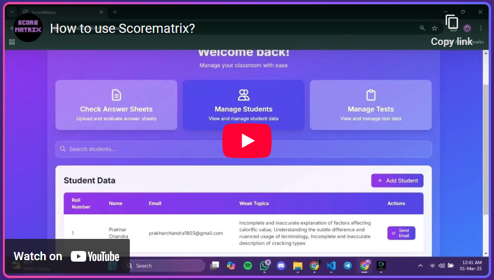
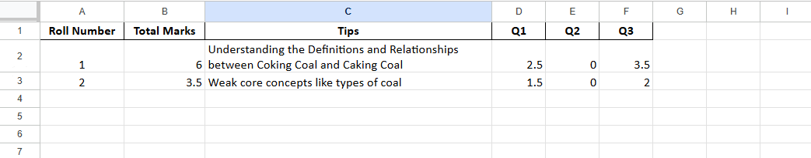
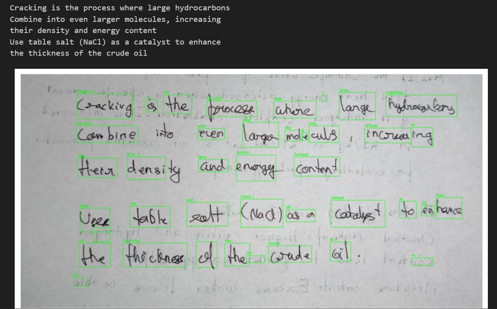
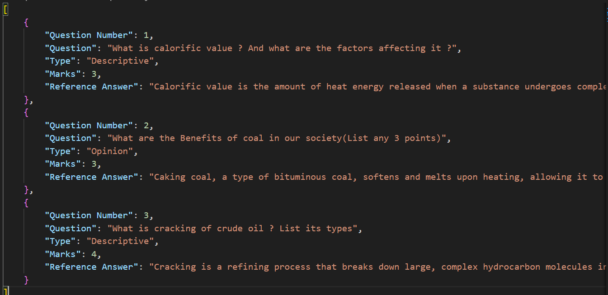
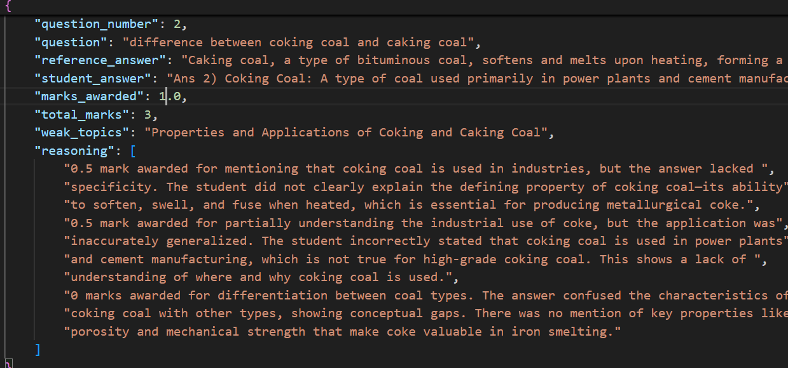
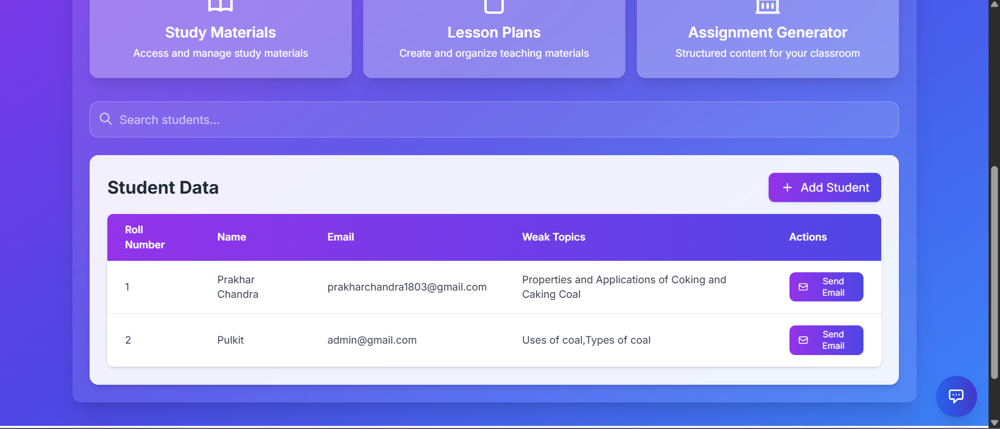
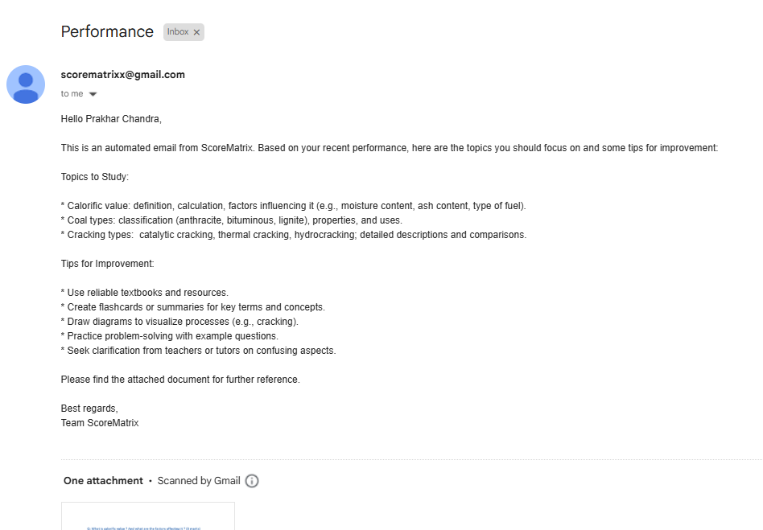
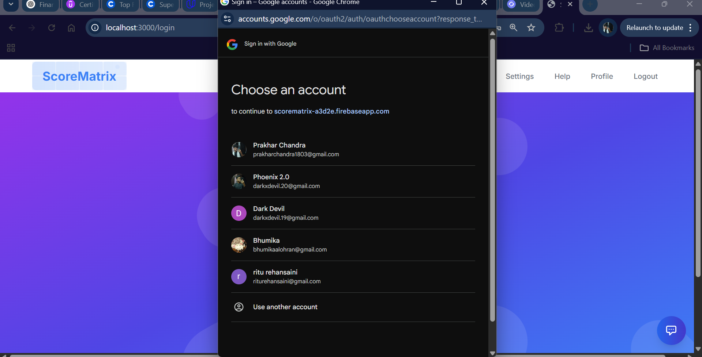
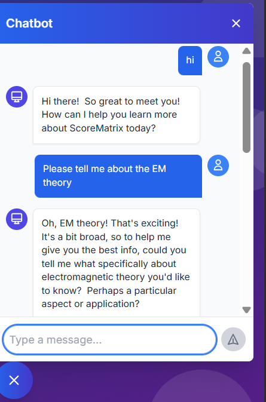

## ScoreMatrix – *Streamline answer sheet evaluation with powerful AI precision*

A cloud-based platform that automates answer sheet evaluation using OCR, RAG-powered answer generation, custom rubrics, and deep performance insights – all from a single interface.

---

## Demo 

Take a quick look at ScoreMatrix in action! Watch how scanned answer sheets are uploaded, automatically evaluated, and analyzed with performance breakdowns.

---

## Core Features

---

### Automated Evaluation  
- Each sheet is processed in real-time, allowing for batch uploads and efficient grading workflows.

- High-accuracy OCR engine extracts answers from scanned handwritten sheets (even with slight noise or skew).

- Built with PyTesseract and OpenCV for preprocessing, enhanced with error-tolerant logic for poorly scanned images.

---

### Question Classification  
- Questions from uploaded PDFs/DOCX files are auto-categorized using NLP classifiers into:
  - Multiple Choice Questions (MCQs)  
  - Descriptive Questions  
  - Opinion-Based Questions  

- Ensures contextual understanding, not just keyword-based classification.
- Custom-trained transformer model with fallback rules for edge cases.

---

### RAG-Powered Answer Generation  
- Uses LangChain + Gemini for context-aware answer generation.
- Teachers upload a reference textbook, syllabus, or notes → ideal answers are generated in seconds.
- RAG (Retrieval-Augmented Generation) ensures content alignment with your source material.
  

    

---

### Custom Rubrics for Grading  
- Teachers define point allocation, required keywords, structure, tone, etc., per question.
- Rubrics are stored per test session, and reused as needed.
- Hybrid grading: ML-based + Rule-based scoring mechanisms.

    

---

### Scoring Justification  
- Each score includes a breakdown:

  - Keyword match score

  - Similarity to reference (and all other parameters choosen

  - Structural alignment (for essays)
- Students can be shown this breakdown optionally for transparency.

---

## Teacher-Focused Tools

---

### Dashboard for Analytics  
- Insights into student performance, weak areas, and overall class trends.  

---

### Personalized Feedback System  
- Automatically emails each student with targeted feedback based on their answer sheet.
- The email also includes the questions, correct answers, general improvement tips, and a list of topics to revise for better understanding

---

### Secure Admin Access  
- Secure login system powered by Firebase.
- Passwordless auth + Google OAuth supported.

---

## Extras

---

### Plagiarism Detection  
- Compares answers across students and online sources using semantic similarity.
- Uses transformer embeddings to catch paraphrased cheating attempts.

--- 

### Answer Quality Grading (A.Q.G.)  
-Scores answers on:
  - Coherence
  - Depth
  - Language use
  - Structural clarity
- A.Q.G. score is separate from the actual score, but helps in holistic assessment.

---

### Smart Chatbot Assistant  
Built-in chatbot helps teachers or students query evaluation results, access rubrics, and get clarification on scoring instantly.  

---

